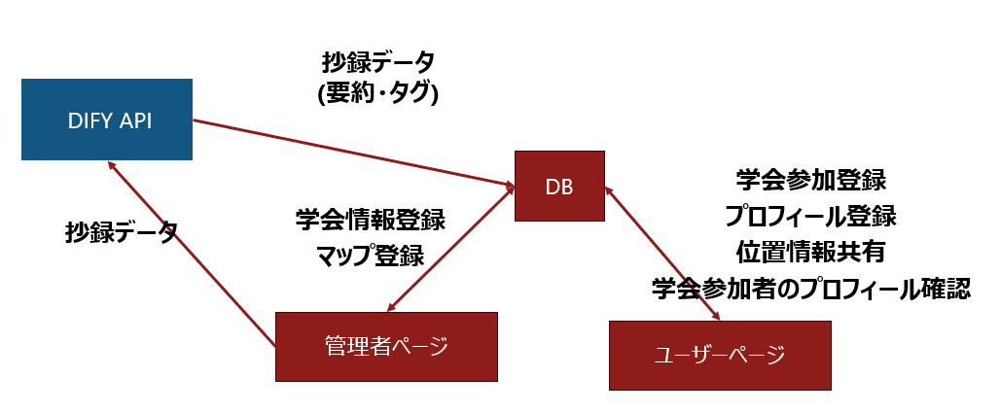

# SympoLink!

参加者ページのデモ動画！画像タップでYoutubeに飛びます！

管理者ページのデモ動画！GIFで載せています！

## 製品概要
### 背景(製品開発のきっかけ，課題等）
- 学会後の懇親会において，シャイな研究者は初対面の人に話しかけに行く心理的なハードルが高い
- 研究テーマや興味が近い人を探そうとしても，紙の名札や冊子ベースの参加者リストでは情報が乏しく，会場内で目当ての人を見つけにくい．
- 話しかけたい人の現在地が分からず合流できない

### 製品説明（具体的な製品の説明）
1. ユーザーはメールアドレスとパスワードでログインし，参加予定の学会を選択・参加登録する．
2. 続いて自己紹介カードを作成し，所属や研究テーマ・興味タグを入力してSupabaseの`introductions`・`tags`テーブルに保存する．
3. ダッシュボード(`/dashboard/:conferenceId`)に進むと，QRコードで現在地を更新しながら会場マップや参加者リスト，興味に合う発表のレコメンドを閲覧でき，現地で話しかけるべき人やブースを瞬時に把握できる．

### ワークフロー

以下の図に、管理者ページとユーザーページ，データベース，DIFY_APIの関係を示します！

補足説明（図の内容）
- 管理者ページから抄録データ（PDF/テキスト）を送信し、DIFY APIで解析します。
- DIFY APIは抄録データをもとに要約・タグを生成し、DBに保存されるデータ（抄録データ／要約・タグ）を返します。
- 管理者ページは生成結果を確認しつつDBへ登録します。ユーザーページはDBから抄録・要約・タグを参照して表示します。

### 解決出来ること
- 懇親会前に互いの興味・研究テーマを共有でき，話かけるハードルを下げる
- 同じ学会に参加している仲間の位置や最新の自己紹介をリアルタイムに把握し，会場内での合流率を高められる．
- 興味タグと連動したリコメンド機能により，話かけるべき人が分からないという課題を解消

### 今後の展望
- 現在は，ユーザーの入力が多いので，LinkedInやResearchMapなどからデータを取得できるようにする．
- 現在は，興味タグや職業によるマッチングを支援しているので，こちらをAIを使用したマッチングでUXの向上．
- 学会中，会場マップ上に混雑状況やポスターの配置などを確認できるようにする
- 懇親会後のつながりも増やすためのチャット機能
- 学会中に話しかけたいと思った人を忘れないための，お気に入り機能
- 管理者ページで，参加者の行動を分析するダッシュボードの作成

### こだわり
- 実際に学会で使用することを想定して，管理者ページも作成して，その部分で学会の登録や抄録のAI分析が行えるようにしている．
- モバイルでも片手操作しやすいUIを作成．
- 各学会ごとにパスワードを使用することで，一人が複数の学会に参加できるように設定している．
- ハードウェアに頼らず，QRコードを使用する実装によって簡易的に場所の共有ができる実装にしている．
- 学会選択や自己紹介の状態をReact ContextとLocalStorageで同期し，再訪時でも入力の手戻りが起きないようにした．

## 開発技術
### 活用した技術

#### フレームワーク・ライブラリ・モジュール
- Vite + React 18 + React Router 6
- Tailwind CSS, class-variance-authority, framer-motion
- @tanstack/react-query, React Hook Form（一部フォーム）
- @yudiel/react-qr-scanner, date-fns, D3 / Recharts
- Vitest, React Testing Library

#### デバイス
- スマートフォン／タブレットのカメラ（QRコード読み取り用）
- ノートPC・タブレット（ダッシュボード閲覧，会場マップ操作）
