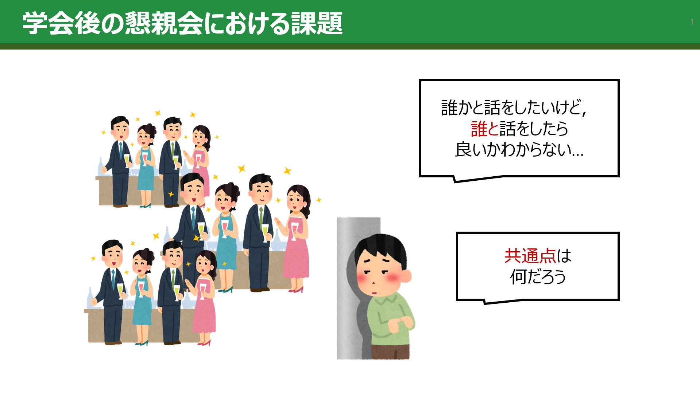

# SympoLink!

Hack day時のデモ

## 追加機能デモ
https://youtu.be/i-oigWWsAOg

## 管理者ページデモ
https://youtu.be/4IJA43175YQ

---

## ユーザページ（デプロイ済）
https://sympolink.vercel.app/

### ユーザ名

- メールアドレス：takosupurinpurin@gmail.com
- パスワード：123456

### 学会

- 学会名：JP_HACKS2025
- パスワード：a

で使用可能です

## 管理者ページ
https://tk-b-2506.vercel.app/

---

## 製品概要
### 背景(製品開発のきっかけ，課題等）

### システム構成図と工夫点

以下の図に、管理者ページとユーザーページ，supabase, 外部APIとの関係を以下に示します．

補足説明（図の内容）
- Research Map APIを使用して，ユーザーがResearch Mapのidを入力することで，ユーザーの入力情報を削減することが可能
- LINEのMessaging APIを使用して，ユーザーがメッセージを受け取った場合は即時通知を行い，ユーザーがすぐに通知を確認可能
- Open AI APIを使用することで，管理者が抄録を読み込ませて，要約とタグ出力をさせることが可能

### 解決出来ること
- 懇親会前に互いの興味・研究テーマを共有でき，話かけるハードルを下げる
- チャットでアポイントメントをとることで，話したいけど話せなかったをなくす
- 同じ学会に参加している仲間の位置や最新の自己紹介をリアルタイムに把握し，会場内での合流率を高められる．
- 興味タグと連動したリコメンド機能により，話かけるべき人が分からないという課題を解消

---

### こだわり
- 実際に学会で使用することを想定して，管理者ページも作成して，その部分で学会の登録や抄録のAI分析が行えるようにしている．
- モバイルでも片手操作しやすいUIを作成．
- 各学会ごとにパスワードを使用することで，一人が複数の学会に参加できるように設定している．
- ハードウェアに頼らず，QRコードを使用する実装によって簡易的に場所の共有ができる実装にしている．
- 学会選択や自己紹介の状態をReact ContextとLocalStorageで同期し，再訪時でも入力の手戻りが起きないようにした．
- チャットとラインが連携しており,チャットが来たことの通知をラインにも来るようにした

### 本システムの応用例
- 新卒の懇親会
知らない人に話しかけづらく，企業側が会を用意しても仲が深まらないという課題をシステムの導入により，離職率の低下につなげることもできます．

- 展示会（EXPO）
ブースの混雑状況の可視化が難しいことや人が多くて話しかけづらいという課題をシステムの導入により，運営側が来場者導線を確認することができます．

## 開発技術
### 活用した技術詳細

#### フレームワーク・ライブラリ・モジュール
- Vite + React 18 + React Router 6
- Tailwind CSS, class-variance-authority, framer-motion
- @tanstack/react-query, React Hook Form（一部フォーム）
- @yudiel/react-qr-scanner, date-fns, D3 / Recharts
- Vitest, React Testing Library

#### デバイス
- スマートフォン／タブレットのカメラ（QRコード読み取り用）
- ノートPC・タブレット（ダッシュボード閲覧，会場マップ操作）
